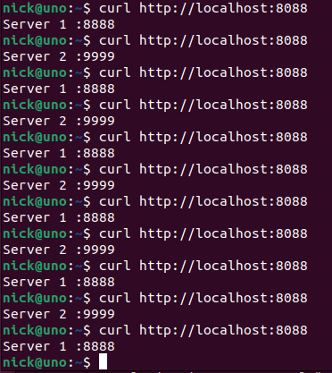
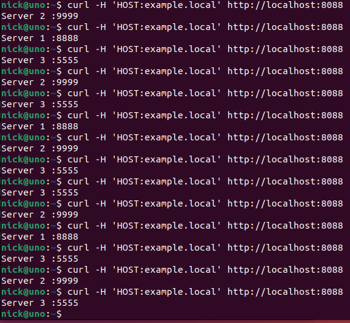
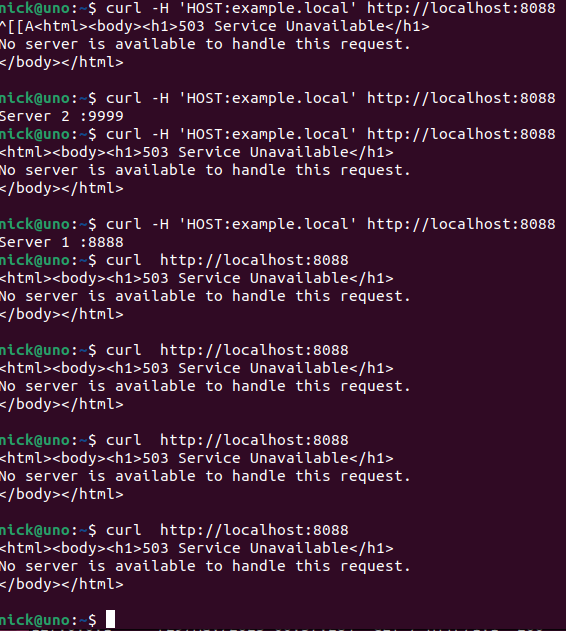

# Домашнее задание к занятию 2 «Кластеризация и балансировка нагрузки»

### Цель задания
В результате выполнения этого задания вы научитесь:
1. Настраивать балансировку с помощью HAProxy
2. Настраивать связку HAProxy + Nginx

------

### Чеклист готовности к домашнему заданию

1. Установлена операционная система Ubuntu на виртуальную машину и имеется доступ к терминалу
2. Просмотрены конфигурационные файлы, рассматриваемые на лекции, которые находятся по [ссылке](2/)


------


### Инструкция по выполнению домашнего задания

1. Сделайте fork [репозитория c шаблоном решения](https://github.com/netology-code/sys-pattern-homework) к себе в Github и переименуйте его по названию или номеру занятия, например, https://github.com/имя-вашего-репозитория/gitlab-hw или https://github.com/имя-вашего-репозитория/8-03-hw).
2. Выполните клонирование этого репозитория к себе на ПК с помощью команды git clone.
3. Выполните домашнее задание и заполните у себя локально этот файл README.md:
   - впишите вверху название занятия и ваши фамилию и имя;
   - в каждом задании добавьте решение в требуемом виде: текст/код/скриншоты/ссылка;
   - для корректного добавления скриншотов воспользуйтесь инструкцией [«Как вставить скриншот в шаблон с решением»](https://github.com/netology-code/sys-pattern-homework/blob/main/screen-instruction.md);
   - при оформлении используйте возможности языка разметки md. Коротко об этом можно посмотреть в [инструкции по MarkDown](https://github.com/netology-code/sys-pattern-homework/blob/main/md-instruction.md).
4. После завершения работы над домашним заданием сделайте коммит (git commit -m "comment") и отправьте его на Github (git push origin).
5. Для проверки домашнего задания преподавателем в личном кабинете прикрепите и отправьте ссылку на решение в виде md-файла в вашем Github.
6. Любые вопросы задавайте в чате учебной группы и/или в разделе «Вопросы по заданию» в личном кабинете.


------


### Задание 1
- Запустите два simple python сервера на своей виртуальной машине на разных портах
- Установите и настройте HAProxy, воспользуйтесь материалами к лекции по [ссылке](2/)
- Настройте балансировку Round-robin на 4 уровне.
- На проверку направьте конфигурационный файл haproxy, скриншоты, где видно перенаправление запросов на разные серверы при обращении к HAProxy.


### *Ответ*

- конфигурация  (окончание)

[haproxy-1.cfg](2/haproxy-1.cfg)

```sh
listen stats  # веб-страница со статистикой
        bind                    :888
        mode                    http
        stats                   enable
        stats uri               /stats
        stats refresh           5s
        stats realm             Haproxy\ Statistics

frontend http-site
        mode http
        bind :8088
        default_backend python-servers
#       acl host_example_local hdr(host) -i example.local
#       use_backend python-servers if host_example_local

backend python-servers
        mode http
        balance roundrobin
        option httpchk
        http-check send meth GET uri /index.html
        server s1 127.0.0.1:8888 check
        server s2 127.0.0.1:9999 check
#       server ser3 127.0.0.1:8883 weight 4
listen web_tcp

        bind :1325

        server s1 127.0.0.1:8888 check inter 3s
        server s2 127.0.0.1:9999 check inter 3s

```


- скрин работы




### Задание 2
- Запустите три simple python сервера на своей виртуальной машине на разных портах
- Настройте балансировку Weighted Round Robin на 7 уровне, чтобы первый сервер имел вес 2, второй - 3, а третий - 4
- HAproxy должен балансировать только тот http-трафик, который адресован домену example.local
- На проверку направьте конфигурационный файл haproxy, скриншоты, где видно перенаправление запросов на разные серверы при обращении к HAProxy c использованием домена example.local и без него.


### *Ответ*

- конфигурация  (окончание)

[haproxy-2.cfg](2/haproxy-2.cfg)

```sh
listen stats  # веб-страница со статистикой
        bind                    :888
        mode                    http
        stats                   enable
        stats uri               /stats
        stats refresh           5s
        stats realm             Haproxy\ Statistics

frontend http-site
        mode http
        bind :8088
#       default_backend python-servers
        acl host_example_local hdr(host) -i example.local
        use_backend python-servers if host_example_local

backend python-servers
        mode http
        balance roundrobin
        option httpchk
        http-check send meth GET uri /index.html
        server s1 127.0.0.1:8888 weight 2
        server s2 127.0.0.1:9999 weight 3
        server s3 127.0.0.1:5555 weight 4
#listen web_tcp
#
#       bind :1325
#
#       server s1 127.0.0.1:8888 check inter 3s
#       server s2 127.0.0.1:9999 check inter 3s

```


- скрин работы 1



- скрин работы 2



---


### Критерии оценки

- Зачет - выполнены все задания, ответы даны в развернутой форме, приложены требуемые скриншоты, конфигурационные файлы, скрипты. В выполненных заданиях нет противоречий и нарушения логики
- На доработку - задание выполнено частично или не выполнено, в логике выполнения заданий есть противоречия, существенные недостатки, приложены не все требуемые материалы.